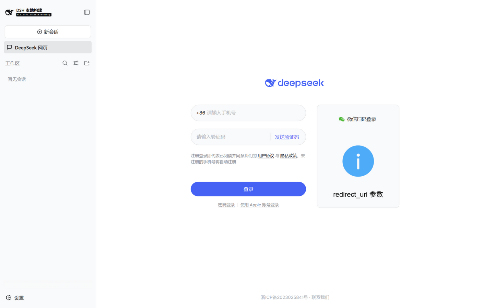

# dsh-deepseek-web · DeepSeek Harness 网页版内嵌插件

在 DeepSeek Harness（dsh）的侧边栏"**工作区**"上方插入一个"**DeepSeek 网页**"入口；点击后，Harness
会话区直接内嵌网页版 DeepSeek（chat.deepseek.com），无需切窗口、无需另开浏览器，也**不消耗 Harness 会话
token**。适配 `dsh web`（浏览器）与官方 Electron 桌面端两种形态。



## 为什么需要它

`chat.deepseek.com` 下发 `Content-Security-Policy: frame-ancestors 'none'`，任何页面都无法用 iframe 直接
内嵌它；官方桌面壳又刻意禁用了对外导航与外部窗口。本插件在 **Harness 宿主进程内**（插件 host 半与 host
同进程）启动一个**仅绑定 127.0.0.1 的本地反向代理**，由它转发并清洗响应：

- 剥掉 `frame-ancestors` / `X-Frame-Options` / COOP/COEP 等框架拒绝头；
- 把页面里指向 `fe-static.deepseek.com` 的绝对地址改写为代理相对路径（`/fe-static/...`），绕过该 CDN 对
  非 `*.deepseek.com` 来源的 CORS 拒绝；HTML/JS/CSS 文本做改写，其余内容字节流直通；
- 改写 `Set-Cookie`（去掉 Domain/Secure）与同域重定向，登录态保存在代理 origin 的 cookie jar 中。

浏览器把 `127.0.0.1` 视为"先验可信来源"，因此桌面端 `dsh-app://`（secure scheme）页面 iframe 本地代理
不算混合内容——两种形态统一适用。

## 插件结构（官方协议）

```
dsh-deepseek-web/
├── package.json        # dsh.bundle（可安装 bundle）+ dsh.client（浏览器半，platform: web）
├── cordis.patch.yml    # bundle 补丁：- insert: [{ id: deepseek-web, name: dsh-deepseek-web }]
├── lib/index.js        # host 半：apply(ctx, config)，本地回环反代服务器（node:http/https/tls）
├── lib/client.js       # 浏览器半：closure-factory 产物（window.__ModuleLoader__.load），注册 UI
└── scripts/            # 桌面端开发模式启动器 + 冒烟测试
```

浏览器半通过官方 **Slots** 机制注入 UI：

- `sidebar.panellist` 注册面板行（`{ id: 'deepseek-web', order: 0, label }` + 图标组件）——该导航渲染在
  "新会话"与"工作区"之间，即目标位置；
- `main`（keyed slot）注册 `key: 'deepseek-web'` 的主区面板组件，点击行后由 `ctx.layout.selectPanel`
  切换主区，面板内容为全幅 iframe。

## 安装

### 方式一：`dsh web`（浏览器形态，持久生效）

```sh
# 在 deepseek-harness 仓库内
pnpm dsh plugin --profile web add <本插件仓库的绝对路径>   # 拷贝安装，官方 reconcile 流程
pnpm dsh web                                          # 重启后生效
```

开发迭代推荐直接用 file URL 补丁行（免拷贝、改完即生效，重启 profile 即可），
写入 `%USERPROFILE%\.dsh\profiles\web\cordis.patch.yml`：

```yaml
- insert:
    - id: deepseek-web
      name: 'file:///<本插件仓库绝对路径>/lib/index.js'
```

> file URL 方式要求插件目录已执行 `npm install`（解析 `@deepseek-ai/schemastery`）。

### 方式二：官方桌面端（Electron，已打包安装版）

桌面壳独占 `$DSH_HOME/profiles/desktop`，通过**应用菜单 → 插件管理**窗口安装（支持本地路径 / tgz /
git），安装后自动写入 `dsh.profile.bundles`。

### 方式三：桌面端开发模式（`pnpm start:desktop`）

> 注：`启动DSH桌面端-含插件.cmd` 现为禁用桩——Harness 已切换为打包桌面应用，不再通过
> `pnpm start:desktop` 拉 dev 模式。桌面开发依赖的注入脚本 `scripts/inject-dev-project.mjs` 仍保留，
> 需要时执行 `node scripts/inject-dev-project.mjs --harness <harness 仓库路径> --once` 手动注入即可。

开发模式每次启动都会**重建**一次性项目（`apps/desktop/.desktop-build/development/project`），装进去的
插件不会存活；该脚本在"项目重建完成 → Host 启动"的窗口期把 file URL 补丁行写进项目的
`cordis.patch.yml`（Loader 行原生支持绝对路径，client 半通过最近 package.json 自动发现，无需 junction）。
已打包用户推荐直接用 **DSH++ 面板 → 插件管理 → 导入** 本插件。

## 配置

| 字段 | 默认 | 说明 |
|---|---|---|
| `port` | `3838` | 回环代理端口；被占用时向上扫描 `portScan` 个 |
| `portScan` | `10` | 额外尝试的端口数（面板按 3838..3848 探测） |
| `upstream` | `https://chat.deepseek.com` | 目标站点 |
| `startPath` | `/`（站点根路径） | 面板打开的会话路径；可设为某共享会话 `/a/chat/s/<id>` |
| `userAgent` | Chrome UA | 仅当浏览器请求未带 UA 时使用 |
| `debug` | `false` | 在启动器 stdout 打印每条代理请求 |

在补丁行的 `config:` 下覆盖（见 cordis.patch.yml 注释）。

## 使用

1. 启动 Harness（`pnpm dsh web` 或上述启动器），点击侧边栏"DeepSeek 网页"；
2. 首次打开是 DeepSeek 登录页：**手机验证码 / 密码登录**均可（登录态存在代理 origin，之后免登录）；
3. 打开你要参照的会话即可在 Harness 内直接阅读，分析过程不再占用会话 token。

## 已知限制

- **微信扫码登录不可用**：微信校验 OAuth `redirect_uri` 域名，代理 origin 无法通过（页面会显示
  "redirect_uri 参数错误"）。请用验证码或密码登录。
- **"使用环境异常"提醒**：DeepSeek 检测到被嵌入时弹出提示，点 × 关闭即可；这是官方風控提示，插件不做
  规避。
- 会话区切回对话时面板会卸载，再次点击即时恢复（端口与路径缓存在浏览器半）。
- 代理仅绑定 127.0.0.1，威胁模型与本机其他本地进程一致；请不要把 `port` 暴露到局域网。

## 验证

```sh
npm install
node scripts/smoke-proxy.mjs   # 独立拉起代理：ping + 拉取会话页 + 断言框架头已剥离
```

集成验证（本仓库开发时的实测）：`pnpm dsh web` 启动后，`window.__DSH_BOOT__` 包含
`dsh-deepseek-web`；侧边栏出现"DeepSeek 网页"；点击后主区加载经代理的 DeepSeek 页面。

## License

MIT
